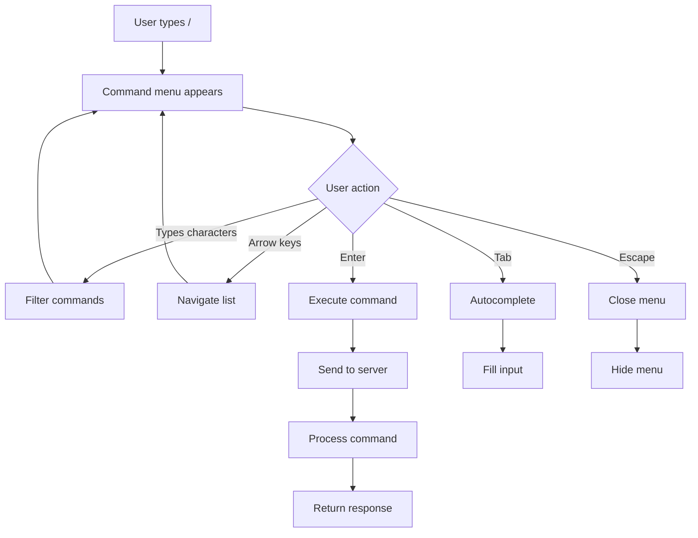

# Slash Commands Feature Documentation

## Overview

The slash commands system provides a keyboard-driven interface for controlling the chat application without leaving the input field. This feature enhances user productivity by offering quick access to common actions and settings.

## Architecture

### Frontend Components

#### 1. **Command Palette** (`/src/web/static/js/slash-commands.js`)
- Event-driven command detection
- Dynamic menu rendering
- Keyboard navigation handler
- Command execution dispatcher

#### 2. **Styling** (`/src/web/static/css/slash-commands.css`)
- Neumorphic design matching the overall UI
- Smooth animations (slideUp effect)
- Dark mode support
- Mobile responsive positioning

#### 3. **Template Integration** (`/src/web/templates/chat_with_commands.html`)
- HTMX-powered chat interface
- SSE connections for streaming
- Minimal JavaScript for enhanced UX

### Backend Components

#### 1. **Command Handlers** (`/src/web/handlers/commands.rs`)
- RESTful API endpoints for each command
- Session management integration
- Model control interfaces

#### 2. **Routes** (`/src/web/routes.rs`)
```rust
.route("/api/reset-context", post(reset_context))
.route("/api/set-temperature", post(set_temperature))
.route("/api/model-info", get(model_info))
.route("/api/status", get(system_status))
.route("/api/export-chat", get(export_chat))
```

## Available Commands

### Chat Commands
| Command | Description | Action |
|---------|------------|--------|
| `/clear` | Clear chat history | Removes all messages from current session |
| `/reset` | Reset context | Clears conversation memory |
| `/export` | Export chat | Downloads conversation as text file |

### Model Commands
| Command | Description | Action |
|---------|------------|--------|
| `/thinking` | Toggle thinking mode | Enables/disables reasoning tokens |
| `/temp` | Set temperature | Adjusts creativity (0.0-1.0) |
| `/model` | Model info | Shows current model status |

### Utility Commands
| Command | Description | Action |
|---------|------------|--------|
| `/help` | Show help | Lists all available commands |
| `/status` | System status | Displays server metrics |
| `/theme` | Toggle theme | Switches dark/light mode |
| `/settings` | Open settings | Shows configuration panel |

### Quick Actions
| Command | Description | Action |
|---------|------------|--------|
| `/quote` | Quote scripture | Streams test passage |
| `/summarize` | Summarize chat | Requests conversation summary |
| `/continue` | Continue response | Extends last message |
| `/regenerate` | Regenerate | Creates new response |

## User Interaction Flow



## Implementation Details

### Command Detection
```javascript
// Detect slash at beginning or after space
if (lastChar === '/' && (cursorPos === 1 || value[cursorPos - 2] === ' ')) {
    showMenu();
}
```

### Command Structure
```javascript
{
    category: 'Chat',
    name: 'clear',
    description: 'Clear the chat history',
    icon: '🗑️',
    shortcut: '/clear',
    action: () => clearChat()
}
```

### Menu Positioning
- Absolute positioning relative to input wrapper
- Appears above input field with 8px gap
- Max height of 300px with scroll
- Z-index 1000 for proper layering

### Keyboard Navigation
- **↑/↓**: Navigate commands
- **Enter**: Execute selected command
- **Tab**: Autocomplete command
- **Escape**: Close menu
- **Typing**: Filter commands

## Extensibility

### Adding New Commands

1. **Frontend**: Add to commands array in `slash-commands.js`:
```javascript
{
    category: 'Custom',
    name: 'mycommand',
    description: 'My custom command',
    icon: '🎯',
    shortcut: '/mycommand',
    action: () => myCustomAction()
}
```

2. **Backend**: Add handler in `commands.rs`:
```rust
pub async fn my_command(
    State(state): State<AppState>,
) -> StatusCode {
    // Implementation
    StatusCode::OK
}
```

3. **Route**: Register in `routes.rs`:
```rust
.route("/api/my-command", post(my_command))
```

## Performance Considerations

- Commands are filtered client-side for instant feedback
- Menu renders only visible items (virtualization for large lists)
- Debounced search with 50ms delay
- Lazy loading of command actions

## Accessibility

- Full keyboard navigation support
- ARIA labels for screen readers
- High contrast mode compatible
- Focus management for keyboard users
- Semantic HTML structure

## Testing

The `/quote` command serves as a comprehensive test for:
- Command detection and execution
- Server-side command processing
- SSE streaming functionality
- Response buffer behavior
- Markdown to HTML conversion

## Future Enhancements

1. **Command History**: Track recently used commands
2. **Custom Shortcuts**: User-defined command aliases
3. **Command Chaining**: Execute multiple commands
4. **Context-Aware Commands**: Show relevant commands based on chat state
5. **Plugin System**: Allow third-party command extensions
